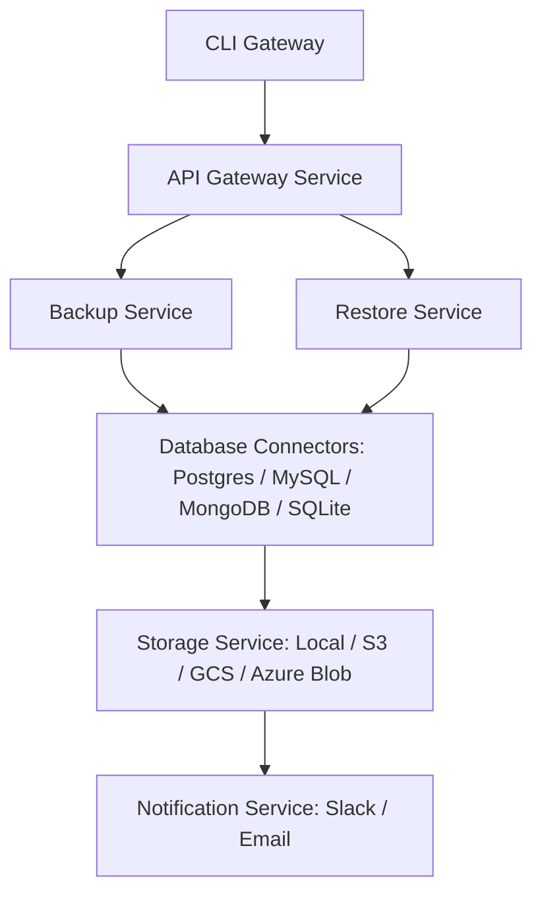

# DB-Backup CLI

A production-ready, cross-platform database backup and restore system built using a microservices architecture. The project provides a unified command-line interface for managing backups across multiple database engines, cloud storage providers, and deployment environments.

Designed as a systems-focused backend project, it demonstrates distributed architecture, service communication, scheduling, security, automation, and cloud integration concepts commonly used in enterprise environments.

## Features

### Database Support

* PostgreSQL
* MySQL / MariaDB
* SQLite
* MongoDB

### Backup Operations

* Full backups
* Incremental backups
* Differential backups
* Compressed backups
* Scheduled backups
* Backup retention policies

### Restore Operations

* Full database restore
* Selective table/collection restore
* Restore validation
* Dry-run restore mode

### Storage Support

* Local filesystem
* AWS S3
* Google Cloud Storage
* Azure Blob Storage

### Security

* AES-256 backup encryption
* Configuration sanitization
* Backup integrity verification
* Checksum validation

### Monitoring

* Health monitoring
* Backup status tracking
* Backup duration metrics
* Storage utilization reporting
* Slack notifications
* Email notifications

### DevOps

* Docker support
* CI/CD automation
* Automated testing
* Structured logging
* Environment-based configuration

## Architecture

The system follows a microservices architecture to ensure scalability, maintainability, and separation of concerns.

## Architecture

The system follows a microservices architecture to ensure scalability, maintainability, and separation of concerns.



## Microservices

### API Gateway

Responsible for:

* Request routing
* Validation
* Service coordination
* Authentication middleware

### Backup Service

Responsible for:

* Full backups
* Incremental backups
* Compression
* Encryption
* Backup metadata generation

### Restore Service

Responsible for:

* Database restoration
* Restore validation
* Recovery workflows
* Dry-run support

### Storage Service

Responsible for:

* Local storage
* Cloud storage uploads
* Cloud storage downloads
* Retention policy enforcement

### Notification Service

Responsible for:

* Slack notifications
* Email alerts
* Backup success/failure reports

### Scheduler Service

Responsible for:

* Cron-based scheduling
* Recurring backup execution
* Automated cleanup jobs

## Technology Stack

### Backend

* Node.js
* TypeScript
* Express.js

### Database Connectivity

* Prisma ORM
* PostgreSQL
* MySQL
* MongoDB
* SQLite

### Infrastructure

* Docker
* Redis
* RabbitMQ

### Cloud Storage

* AWS S3
* Google Cloud Storage
* Azure Blob Storage

### Monitoring

* Winston Logging
* Prometheus Metrics

### Testing

* Jest
* Supertest

## Project Structure

```text
db-backup-cli/

services/
│
├── api-gateway/
├── backup-service/
├── restore-service/
├── storage-service/
├── scheduler-service/
├── notification-service/
│
shared/
├── types/
├── utils/
├── logger/
├── config/
│
docker/
tests/
docs/
```

## Example Commands

Connect to a database:

```bash
db-backup connect \
  --type postgres \
  --host localhost \
  --port 5432 \
  --user admin
```

Create a backup:

```bash
db-backup backup \
  --type full \
  --compress
```

Restore a backup:

```bash
db-backup restore \
  --file backup.gz
```

Schedule automated backups:

```bash
db-backup schedule \
  --cron "0 2 * * *"
```

List available backups:

```bash
db-backup list
```

## Cross-Platform Support

Supported operating systems:

* Windows
* Linux
* macOS

The project automatically uses the appropriate database backup utilities available on the host system:

* pg_dump
* pg_restore
* mysqldump
* mysql
* mongodump
* mongorestore

## Engineering Highlights

* Microservices architecture
* Message queue communication
* Database abstraction layer
* Cloud-native design
* Cross-platform execution
* Backup encryption
* Automated scheduling
* Health monitoring
* Scalable service boundaries
* Production-oriented deployment workflow

## Learning Outcomes

This project demonstrates practical experience with:

* Distributed systems
* Microservices architecture
* Database administration
* Backup and disaster recovery workflows
* Cloud integrations
* System design principles
* Secure software development
* DevOps fundamentals
* API development
* TypeScript backend engineering

## Future Enhancements

* Kubernetes deployment
* Multi-region backup replication
* Web-based management dashboard
* Backup analytics and reporting
* Role-based access control
* Advanced disaster recovery workflows

## Author

Rithish

Second Year Computer Science Engineering Student

Focused on Backend Engineering, Distributed Systems, Databases, Cloud Infrastructure, and System Design.
<!-- 
<div align="center">
  
</div>

<br/>

<div align="center">
  <h3>💻 Full Stack Engineer | CSE'28 | Building the Future, One Commit at a Time 🚀</h3>
  <p>
    <em>
      Crafting scalable, user-centric applications with modern tech stacks.<br/>
      Passionate about clean code, robust APIs, and high-performance digital solutions.<br/>
      Transforming ideas into reality through hands-on experience and innovation.
    </em>
  </p>
</div>

<br/>

<div align="center">
  <a href="https://git.io/typing-svg">
    
  </a>
</div>

<br/>

<p align="center">
  
  <a href="https://github.com/Mithul-varshan?tab=followers"></a>
  <a href="https://github.com/Mithul-varshan"></a>
</p>

---

## 👤 About Me


<div style="margin-top: 30px;">

```javascript
const Rithish = {
  role: "Full Stack Developer",
  education: "B.E. Computer Science Engineering (2028)",
  institution: "Bannari Amman Institute of Technology",
  cgpa: 8.32,
  location: "India 🇮🇳",

  currentFocus: [
    "SaaS Platform Development",
    "React.js, JavaScript & Full-Stack Architecture",
    "Backend Development (Node.js, Express, JWT, OAuth)",
    "RESTful API Design & Integration",
    "Database Design (PostgreSQL), Docker",
    "Scalable System Design"
  ],

  languages: ["Java", "JavaScript", "Python", "C"],

  motto: "Code. Create. Innovate. Repeat."
};
```

<br clear="right"/>

---

## 🛠️ Tech Stack

### Languages
<p>
  
</p>

### Frontend
<p>
  
</p>

### Backend & Databases
<p>
  
</p>

### Tools & Cloud
<p>
  
</p>

<details>
<summary><b>📦 Full Tech Stack Breakdown</b></summary>
<br/>

| Category | Technologies |
|----------|-------------|
| **Frontend** | React.js, HTML5, CSS3, Tailwind CSS, Material-UI, Zustand |
| **Backend** | Node.js, Express.js, REST APIs, JWT, Middleware, Microservices |
| **Databases** | MySQL, PostgreSQL, MongoDB |
| **Cloud & Infra** | Vercel, Docker, Kubernetes |
| **Languages** | JavaScript, Typescript, Java, Python, C |
| **Dev Tools** | VS Code, Git, GitHub, Postman |

</details>

---

## 📊 GitHub Analytics

<p align="center">
  
  &nbsp;
  
</p>

<p align="center">
  
</p>

---

## 🏆 Achievements

| 🎯 | Highlight |
|:--|:---------|
| 🔢 | Solved **1000+ problems** on LeetCode - strong DSA fundamentals |
| 💻 | **1.5K+ commits** across projects and internships on GitHub |
| 📜 | **NPTEL Python Certification** - 95% score |
| 🥈 | **Runner-up at SNS Ideathon** |
| 🥈 | **Runner-up at Prince Intellecthon** |
| 🥇 | **Winner at BIT Hackathon** |
| 🏅 | **1st place at Code-Circle Event** at intra-college level |

---

## 🤝 Let's Connect

<div align="center">

[](https://mithulvarshansk.site/)
[](https://www.linkedin.com/in/mithulvarshan/)
[](mailto:mithul0605@gmail.com)
[](https://github.com/Mithul-varshan)
[](https://drive.google.com/file/d/1stvGvgAo7_oVbS-lN7gfMN8F03Pgq1l2/view?usp=drive_link)

</div>

<div align="center">
  
</div> -->