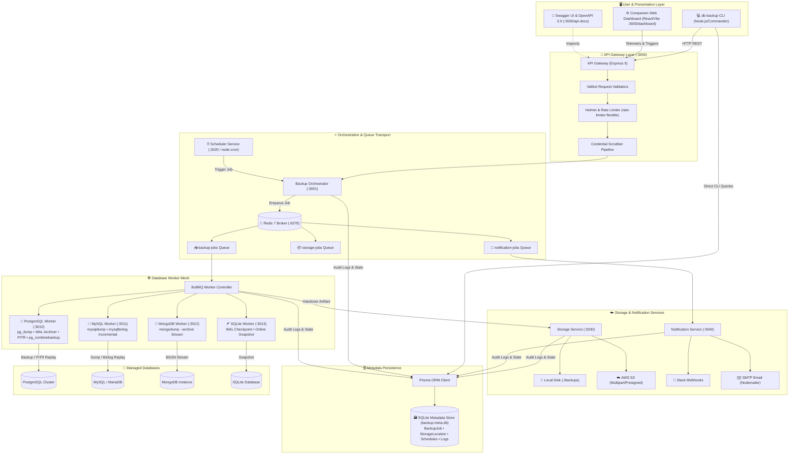

# DB Backup CLI 🛡️

<div align="center">


**A production-grade, distributed database disaster recovery and automated backup platform.**  
Featuring Point-In-Time Recovery (PITR), BullMQ asynchronous worker queues, multi-cloud storage (AWS S3 & Local), AES-256-GCM encryption, OpenAPI 3.0 specifications, and a real-time companion telemetry web dashboard.

[Features](#-key-features) • [Architecture](#-system-architecture) • [Dashboard & CLI Showcase](#-visual-showcase) • [Quick Start](#-quick-start) • [CLI Commands](#-cli-command-reference) • [API & Swagger](#-openapi--swagger-documentation) • [Docker Mesh](#-docker-microservices-mesh)

</div>

---

## 📸 Visual Showcase

### 1. Proactive Health Diagnostics (`db-backup doctor`)
The built-in diagnostic engine validates Node.js versions, configuration health, Docker daemon states, Redis connectivity, database access, keystores, and microservice HTTP endpoints before executing critical jobs.

<div align="center">
  
</div>

---

### 2. Companion Real-Time Monitoring Dashboard
A modern React + Vite monitoring dashboard providing 24-hour reliability metrics, queue saturation rates, live active backup tracking, and complete execution histories.

<div align="center">
  
</div>

---

### 3. Distributed Microservices Health Matrix
Live ping telemetry monitoring all 9 microservices, database workers, Redis connection state, and BullMQ worker process allocations.

<div align="center">
  
</div>

---

### 4. Real-Time Log Inspector & Live Socket Stream
Real-time log streaming directly from worker execution containers, featuring severity filtering (INFO, WARN, ERROR), job ID correlation, and auto-scrolling telemetry.

<div align="center">
  
</div>

---

## 🏗️ System Architecture

`db-backup-cli` is architected as an event-driven microservices mesh decoupled by **BullMQ** and **Redis**. Long-running database dumps never block CLI execution or HTTP threads; instead, operations are streamed through isolated worker containers with automatic retry policies and atomic storage writes.



---

## 🌟 Key Features

* **Multi-Engine Backup & Restore**: Native, zero-disk-overhead streaming support for **PostgreSQL**, **MySQL / MariaDB**, **MongoDB**, and **SQLite**.
* **PostgreSQL Point-In-Time Recovery (PITR)**: Continuous Write-Ahead Log (WAL) archiving via PostgreSQL's `archive_command`, timeline inspection, and timestamp recovery (`recovery_target_time`).
* **MySQL Binary Log Incremental Chains**: Automated incremental backups tracking `mysqlbinlog` position intervals relative to full base level-0 dumps.
* **Asynchronous Distributed Queues**: Powered by **BullMQ** and **Redis** for concurrency management, automatic backoff retries, and job state isolation.
* **Bank-Grade AES-256-GCM Encryption**: Payloads encrypted before storage with unique IVs, auth tags, and an isolated local keystore (`db-backup key`).
* **Multi-Cloud Storage Targets**: Seamless destination abstraction supporting local disks and AWS S3 buckets (with presigned URLs and streaming uploads).
* **Automated Cron Scheduling**: Persistent cron schedules (`db-backup schedule`) managed through an autonomous background scheduler daemon.
* **Proactive Diagnostics (`db-backup doctor`)**: Real-time evaluation of daemon health, host directories, port collisions, keystores, and container health.
* **On-Demand Infrastructure Lifecycle Manager (`db-backup infra`)**: Autonomous Docker Compose adapter to start, stop, restart, and inspect service health on demand.
* **Interactive Onboarding (`db-backup init`)**: Beautiful step-by-step terminal wizard powered by `@clack/prompts`.
* **Complete OpenAPI 3.0 & Swagger UI**: Interactive API documentation hosted at `http://localhost:3000/api-docs`.
* **Zero Credential Leaks**: Custom Winston logging pipeline automatically scrubs passwords, API keys, S3 secrets, and connection URIs from stdout and log files.

---

## 🚀 Quick Start

### Prerequisites
- **Node.js** `>= 20.0.0`
- **Docker** & **Docker Compose** (for microservice orchestration)
- **Redis** running on port `6379` (or launched via `db-backup infra start`)

### 1. Installation

#### Global Install (via npm)
```bash
npm install -g db-backup-cli
db-backup --help
```

#### From Source
```bash
git clone https://github.com/rithishcodespace/db-backup-cli.git
cd db-backup-cli
npm install
npm run build:all
npm link
```

### 2. Interactive Setup Wizard
Run the onboarding wizard to configure database credentials, default storage, and encryption keys:
```bash
db-backup init
```

### 3. Start Infrastructure & Run Diagnostics
```bash
# Start background microservice mesh via Docker
db-backup infra start

# Verify all services and database connectivity
db-backup doctor
```

### 4. Execute a Backup
```bash
# Perform a full backup with compression
db-backup backup --type full --compress

# Perform an AES-256 encrypted backup to AWS S3
db-backup backup --storage s3 --encrypt

# Perform a MySQL or PostgreSQL incremental backup
db-backup backup --incremental
```

---

## 💻 CLI Command Reference

The `db-backup` CLI provides 15 dedicated commands:

| Command | Description | Example |
| :--- | :--- | :--- |
| `init` | Step-by-step interactive onboarding wizard (`@clack/prompts`) | `db-backup init` |
| `doctor` | Proactively audit system, ports, Redis, Docker, and service health | `db-backup doctor` |
| `infra` | Manage Docker Compose runtime infrastructure (`status`, `start`, `stop`, `restart`) | `db-backup infra status` |
| `connect` | Test connection to target database and verify credentials | `db-backup connect --type postgresql` |
| `backup` | Execute a database backup with compression, encryption, and storage options | `db-backup backup --compress --encrypt` |
| `restore` | Restore a database from a local or S3 backup using its full ID | `db-backup restore --id <BACKUP_ID>` |
| `pitr` | Manage PostgreSQL Point-in-Time Recovery (setup, status, backup, restore, list) | `db-backup pitr status` |
| `list` | List historical backups with IDs, file sizes, engine types, and timestamps | `db-backup list --type full` |
| `dashboard` | Launch the companion web monitoring dashboard in your browser | `db-backup dashboard` |
| `schedule` | Register recurring automated cron backup schedules | `db-backup schedule --cron "0 2 * * *"` |
| `schedule:list`| View all active recurring backup schedules | `db-backup schedule:list` |
| `storage` | Configure and test local directory or AWS S3 storage destinations | `db-backup storage list` |
| `notification` | Configure Slack webhooks or SMTP Email alerts and send test pings | `db-backup notification test` |
| `key` | Local AES-256-GCM keystore manager (generate, list, and export keys) | `db-backup key generate` |
| `config` | Validate `./config.json` against required runtime schemas | `db-backup config check` |

---

## ⏱️ PostgreSQL Point-In-Time Recovery (PITR)

`db-backup-cli` provides native Point-in-Time Recovery for PostgreSQL:

```bash
# 1. Verify and auto-configure PostgreSQL WAL archiving
db-backup pitr setup --auto-configure

# 2. Inspect WAL archiving status and recovery boundaries
db-backup pitr status

# 3. Create a physical base backup via pg_basebackup
db-backup pitr backup

# 4. Restore the cluster to an exact target second before an incident
db-backup pitr restore --time "2026-09-09T09:30:00Z" --target "/var/lib/postgresql/restored"
```

---

## 📑 OpenAPI & Swagger Documentation

The API Gateway hosts interactive **Swagger UI** documentation and raw OpenAPI 3.0 JSON specifications covering all microservice endpoints:

* **Interactive Swagger UI**: [http://localhost:3000/api-docs](http://localhost:3000/api-docs)
* **OpenAPI 3.0 Spec (JSON)**: [http://localhost:3000/api-docs/json](http://localhost:3000/api-docs/json)

```text
POST   /api/backup                 # Trigger an asynchronous backup job
GET    /api/backup/:id/status      # Poll real-time job status and progress
POST   /api/restore                # Trigger a restore workflow
GET    /api/dashboard/stats        # Get system health, queue load, and success rates
GET    /api/dashboard/logs         # Stream recent worker logs
POST   /api/storage/upload         # Upload backup artifact to storage target
POST   /api/notifications/test     # Send test alert to Slack / Email
GET    /health                     # Gateway health check
```

---

## 🐳 Docker Microservices Mesh

The complete microservices mesh is orchestrated via [`docker-compose.yaml`](docker-compose.yaml) with multi-stage, security-hardened Alpine containers running as non-root `node` users:

| Service | Port | Description |
| :--- | :---: | :--- |
| **Redis** | `6379` | In-memory message broker & BullMQ queue transport |
| **API Gateway** | `3000` | Public Express gateway, Swagger UI, and dashboard server |
| **Backup Orchestrator** | `3001` | BullMQ job queue manager and coordinator |
| **Scheduler Service** | `3020` | Cron-based automated execution daemon |
| **Storage Service** | `3030` | Local disk and AWS S3 storage provider |
| **Notification Service** | `3040` | Slack Webhook and Nodemailer SMTP dispatcher |
| **PostgreSQL Worker** | `3010` | Isolated worker with `pg_dump`, `pg_basebackup`, and `pg_combinebackup` |
| **MySQL Worker** | `3011` | Isolated worker with `mysqldump` and `mysqlbinlog` |
| **MongoDB Worker** | `3012` | Isolated worker with `mongodump` and `mongorestore` |
| **SQLite Worker** | `3013` | Isolated worker with SQLite WAL snapshot utilities |

```bash
# Start all microservices in the background
npm run docker:up

# View real-time aggregated logs
npm run docker:logs

# Tear down the stack without losing backup data
npm run docker:down
```

---

## 🧪 Automated Testing Suite

The repository includes deterministic unit tests, end-to-end API gateway validation, and integration tests:

```bash
# Run complete test suite (Unit + E2E)
npm test

# Run unit tests only
npm run test:unit

# Run API Gateway E2E tests
npm run test:e2e

# Run TypeScript type check and linter
npm run build && npm run lint
```

**Status:** ✅ **88 passing tests** (81 unit tests + 7 e2e tests), 0 failures.

---

## 📁 Repository Layout

```text
db-backup-cli/
├── bin/                          # Executable binary entrypoint (bin/db_backup.js)
├── dashboard/                    # Companion React + Vite Web Monitoring Dashboard
│   ├── src/                      # UI Components (Health Matrix, Log Inspector, Stats)
│   └── dist/                     # Compiled production UI bundle
├── docker/                       # Production multi-stage Dockerfiles
│   ├── Dockerfile.gateway        # Gateway & Static Dashboard Container
│   ├── Dockerfile.orchestrator   # BullMQ Orchestrator Container
│   ├── Dockerfile.postgres       # PostgreSQL Worker Container
│   ├── Dockerfile.mysql          # MySQL Worker Container
│   ├── Dockerfile.mongodb        # MongoDB Worker Container
│   └── Dockerfile.sqlite         # SQLite Worker Container
├── docs/                         # Architecture assets and documentation
│   └── images/                   # High-resolution screenshots and visuals
├── prisma/                       # Prisma ORM schema and SQLite migrations
├── scripts/                      # Service lifecycle and cross-platform runners
├── src/                          # TypeScript source code
│   ├── commands/                 # 15 CLI command implementations
│   ├── config/                   # Centralized configuration loader
│   ├── infrastructure/           # Docker Compose & local process adapters
│   ├── microservices/            # Gateway, orchestrator, and database workers
│   ├── services/                 # PITR, incremental, and dashboard services
│   ├── swagger/                  # OpenAPI 3.0 specification generator
│   └── validators/               # Valibot request validation schemas
├── tests/                        # Unit, E2E, and integration test suites
├── docker-compose.yaml           # Master multi-container Compose orchestration
└── package.json                  # Dependencies, scripts, and npm metadata
```

---

## 🤝 Contributing

Contributions are welcome! Please check out [CONTRIBUTING.md](CONTRIBUTING.md) and [CODE_OF_CONDUCT.md](CODE_OF_CONDUCT.md) before submitting pull requests.

1. Fork the Project
2. Create your Feature Branch (`git checkout -b feature/AmazingFeature`)
3. Commit your Changes (`git commit -m 'feat: add AmazingFeature'`)
4. Push to the Branch (`git push origin feature/AmazingFeature`)
5. Open a Pull Request

---

## 📄 License

Distributed under the **ISC License**. See [LICENSE](package.json) for more information.
