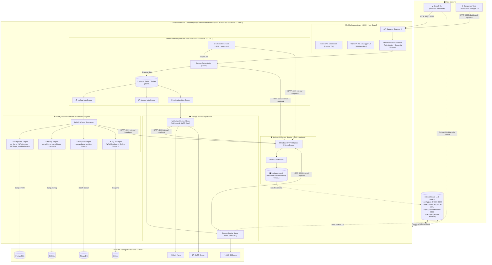
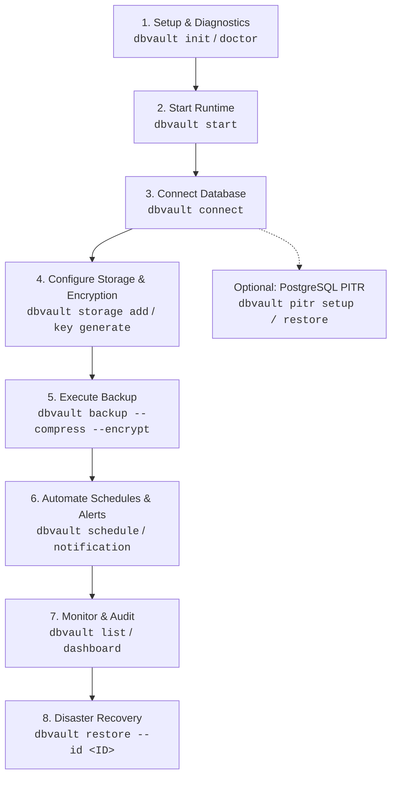

# DBVault 🛡️

<div align="center">


**A production-grade, distributed database disaster recovery and automated backup platform.**  
Featuring Point-In-Time Recovery (PITR), BullMQ asynchronous worker queues, multi-cloud storage (AWS S3 & Local), AES-256-GCM encryption, OpenAPI 3.0 specifications, and a real-time companion telemetry web dashboard.

[Features](#-key-features) • [Architecture](#-system-architecture) • [Dashboard & CLI Showcase](#-visual-showcase) • [Quick Start](#-quick-start) • [End-to-End User Guide](#-end-to-end-cli-flow-user-guide) • [CLI Command Reference](#-complete-cli-command-reference) • [API & Swagger](#-openapi--swagger-documentation) • [Docker Mesh](#-docker-microservices-mesh)

</div>

---

## 📸 Visual Showcase

### 1. Proactive Health Diagnostics (`dbvault doctor`)
The built-in diagnostic engine validates Node.js versions, configuration health, Docker daemon states, Redis connectivity, database access, keystores, and microservice HTTP endpoints before executing critical jobs.

<div align="center">
  
</div>

---

### 2. Companion Real-Time Monitoring Dashboard
A modern React + Vite monitoring dashboard providing 24-hour reliability metrics, queue saturation rates, live active backup tracking, and complete execution histories.

<div align="center">
  
</div>

---

### 3. Distributed Microservices Health Matrix
Live ping telemetry monitoring all 9 microservices, database workers, Redis connection state, and BullMQ worker process allocations.

<div align="center">
  
</div>

---

### 4. Real-Time Log Inspector & Live Socket Stream
Real-time log streaming directly from worker execution containers, featuring severity filtering (INFO, WARN, ERROR), job ID correlation, and auto-scrolling telemetry.

<div align="center">
  
</div>

---

## 🏗️ System Architecture

**DBVault** employs an all-in-one containerized microservices architecture with an asynchronous, event-driven queue pipeline powered by **BullMQ** and **Redis**. Long-running database dumps never block the CLI or HTTP request threads; instead, backup and restore jobs are dispatched through supervised worker engines with automatic retry policies, credential scrubbing, and atomic storage handoffs.



> **Security & Concurrency Architecture Highlights**:
> 1. **Single Public Port Security**: Port **`3000`** is the **only** port exposed to the host machine. All inter-service communications (Redis `:6379`, Orchestrator `:3001`, Workers `:3010-:3013`, Scheduler `:3020`, Storage `:3030`, Notification `:3040`, and Metadata `:3005`) communicate strictly across container-internal loopback (`127.0.0.1`), preventing any external network exposure of internal subsystems.
> 2. **Least Privilege Container**: The production container executes under the dedicated non-root user **`dbvault`** (`UID:GID 10001:10001`), ensuring container processes cannot compromise host environments.
> 3. **Single Metadata Service Boundary**: The **Metadata Service** is the **sole owner** of `backup-meta.db`. No other microservice or CLI process accesses SQLite directly or imports Prisma. Database access is encapsulated behind this dedicated HTTP service boundary (`MetadataClient`), eliminating cross-process file locking contention. SQLite runs in `WAL` mode (`busy_timeout = 5000ms`, `synchronous = NORMAL`) for high-throughput, crash-resilient persistence.


---

## 🌟 Key Features

* **Multi-Engine Backup & Restore**: Native, zero-disk-overhead streaming support for **PostgreSQL**, **MySQL / MariaDB**, **MongoDB**, and **SQLite**.
* **PostgreSQL Point-In-Time Recovery (PITR)**: Continuous Write-Ahead Log (WAL) archiving via PostgreSQL's `archive_command`, timeline inspection, and timestamp recovery (`recovery_target_time`).
* **MySQL Binary Log Incremental Chains**: Automated incremental backups tracking `mysqlbinlog` position intervals relative to full base level-0 dumps.
* **Asynchronous Distributed Queues**: Powered by **BullMQ** and **Redis** for concurrency management, automatic backoff retries, and job state isolation.
* **Bank-Grade AES-256-GCM Encryption**: Payloads encrypted before storage with unique IVs, auth tags, and an isolated local keystore (`dbvault key`).
* **Multi-Cloud Storage Targets**: Seamless destination abstraction supporting local disks and AWS S3 buckets (with presigned URLs and streaming uploads).
* **Automated Cron Scheduling**: Persistent cron schedules (`dbvault schedule`) managed through an autonomous background scheduler daemon.
* **Proactive Diagnostics (`dbvault doctor`)**: Real-time evaluation of daemon health, host directories, port collisions, keystores, and container health.
* **On-Demand Infrastructure Lifecycle Manager (`dbvault infra`)**: Autonomous Docker Compose adapter to start, stop, restart, and inspect service health on demand.
* **Interactive Onboarding (`dbvault init`)**: Beautiful step-by-step terminal wizard powered by `@clack/prompts`.
* **Complete OpenAPI 3.0 & Swagger UI**: Interactive API documentation hosted at `http://localhost:3000/api-docs`.
* **Zero Credential Leaks**: Custom Winston logging pipeline automatically scrubs passwords, API keys, S3 secrets, and connection URIs from stdout and log files.

---

## 🚀 Quick Start

### Prerequisites
- **Node.js** `>= 18.0.0`
- **Docker** & **Docker Compose** (for the all-in-one production runtime)

### 1. Installation

#### Global Install (via npm)
```bash
npm install -g dbvault
dbvault --help
```

> **Note**: The npm package is published as **`dbvault`**, and the executable CLI command registered globally is **`dbvault`**.

#### From Source
```bash
git clone https://github.com/rithishcodespace/db-backup-cli.git
cd db-backup-cli
npm install
npm run build:all
npm link
```

### 2. First-Time Setup Wizard
Run the onboarding wizard to configure database credentials, default storage, and encryption keys:
```bash
dbvault init
```

### 3. Start the Production Runtime & Verify
Start the all-in-one container and verify environment health:
```bash
# Start the production container and await microservice readiness
dbvault start

# Inspect running container and supervised microservices
dbvault status

# Run proactive health diagnostics
dbvault doctor
```

### 4. Execute Backups & Manage Lifecycle
```bash
# Perform a full backup with compression
dbvault backup --type full --compress

# Perform an AES-256 encrypted backup to AWS S3
dbvault backup --storage s3 --encrypt

# Stream or tail worker execution logs
dbvault logs --tail 25

# Gracefully stop the runtime (all backup files & volumes safely preserved)
dbvault stop
```

### 5. Uninstallation
To completely remove the global CLI:
```bash
npm uninstall -g dbvault
```

---

## 🔄 End-to-End CLI Flow User Guide

The following flowchart illustrates the typical operational lifecycle of a production database disaster recovery setup using **DBVault**:



### Stage 1: Initial Setup & Environment Verification
1. Run the interactive onboarding wizard to configure database credentials, default storage target, and initial encryption keys:
   ```bash
   dbvault init
   ```
2. Inspect environment health, required ports, Redis, Docker, and file permissions:
   ```bash
   dbvault doctor
   ```
3. Start the production runtime container:
   ```bash
   dbvault start
   dbvault status
   ```

### Stage 2: Database Connection & Verification
Connect your active database and test connectivity across any supported engine (PostgreSQL, MySQL, MongoDB, SQLite):
```bash
# PostgreSQL
dbvault connect --type postgresql --host localhost --port 5432 --user postgres --password secret --database my_production_db

# MySQL / MariaDB
dbvault connect --type mysql --host localhost --port 3306 --user root --password secret --database app_db

# MongoDB
dbvault connect --type mongodb --host localhost --port 27017 --database store_db

# SQLite
dbvault connect --type sqlite --database ./data/app.db
```
Verify the active configuration and service connectivity at any time:
```bash
dbvault config check
```

### Stage 3: Storage Destinations & Security Keystores
Set up local directory vaults or AWS S3 cloud buckets:
```bash
# Add a local off-site directory
dbvault storage add --type local --name local-vault --path /mnt/secure_backups

# Add an AWS S3 bucket destination
dbvault storage add --type s3 --name aws-vault --bucket my-company-backups --region us-east-1 --access-key AKIA... --secret-key wJalr...

# Set default storage destination
dbvault storage set-default aws-vault

# Test connectivity to a storage destination
dbvault storage test aws-vault

# Generate a 256-bit AES cryptographic key
dbvault key generate
dbvault key list
```

### Stage 4: Executing Database Backups
Trigger backups with streaming compression, AES-256-GCM encryption, and custom tables:
```bash
# Fast compressed full backup
dbvault backup --type full --compress

# Bank-grade encrypted backup uploaded to AWS S3
dbvault backup --storage aws-vault --compress --encrypt

# Backup specific tables only
dbvault backup --tables users,orders,transactions

# Non-blocking asynchronous backup queued via BullMQ
dbvault backup --async
```

### Stage 5: Scheduling & Multi-Channel Alerts
Automate recurring backup policies with cron expressions and connect alert integrations:
```bash
# Configure Slack notifications
dbvault notification slack configure --webhook https://hooks.slack.com/services/T00/B00/X00
dbvault notification slack test

# Configure SMTP Email notifications
dbvault notification email configure --smtp-host smtp.gmail.com --smtp-port 587 --smtp-user alerts@myorg.com --smtp-password "app-pwd" --from alerts@myorg.com --to devops@myorg.com
dbvault notification email test

# Schedule a daily backup at 2:00 AM with Slack + Email alerts
dbvault schedule --cron "0 2 * * *" --name "daily-production-backup" --storage s3 --retention 30 --notify slack,email

# Inspect all active automated backup schedules
dbvault schedule:list
```

### Stage 6: Telemetry, Logs & Monitoring
Inspect historical backups and launch the companion web dashboard:
```bash
# List all successful historical backups with full restore IDs
dbvault list --status success --limit 20

# Launch the companion React + Vite telemetry web dashboard
dbvault dashboard
```

### Stage 7: Disaster Recovery & Atomic Restoration
Restore database from disaster with full validation, dry runs, and safety prompts:
```bash
# 1. Perform a non-destructive dry-run first
dbvault restore --id <BACKUP_ID> --dry-run

# 2. Execute full restore (automatically retrieves encryption keys and validates SHA-256 checksums)
dbvault restore --id <BACKUP_ID>

# 3. Restore with table overwrite (drops existing tables before restoring data)
dbvault restore --id <BACKUP_ID> --drop-existing

# 4. Restore directly from a raw or encrypted local file
dbvault restore --file ./backups/production_dump.sql.gz.enc --key <64-HEX-KEY>
```

---

## 💻 Complete CLI Command Reference

Below is the comprehensive reference for all commands and options in **DBVault**.

### 1. `dbvault init`
Interactive step-by-step terminal wizard powered by `@clack/prompts` to onboard a new environment, configure database credentials, default storage, and encryption keys.
```bash
dbvault init
```

### 2. `dbvault doctor`
Audits environment dependencies (Node.js, Docker, Compose), port health, Redis broker, background microservices, metadata SQLite database, and keystore state.
```bash
dbvault doctor
```

### 3. Production Container Lifecycle: `start`, `status`, `stop`, `restart`, `logs`
Manage the unified production container (`rithish2006/db-backup:1.0.0`) directly from the host CLI:
- **`dbvault start`** — Launches the background container and waits for the API gateway and workers to reach healthy status.
- **`dbvault status`** — Displays health metrics for the container, uptime, port bindings, and internal microservices.
- **`dbvault stop`** — Gracefully terminates container execution while safely preserving all backup volumes and SQLite metadata.
- **`dbvault restart`** — Performs a graceful restart cycle and verifies health readiness.
- **`dbvault logs [--tail <lines>] [--follow]`** — Streams real-time aggregated container telemetry directly to stdout.

```bash
dbvault start
dbvault status
dbvault logs --tail 50
dbvault stop
```

*(Alternatively, `dbvault infra <start|status|stop|restart|logs>` is supported as an advanced alias).*

### 4. `dbvault connect`
Test connection to target database and save active configuration to `config.json`.
- **Options**:
  - `-t, --type <type>` *(required)*: `postgresql`, `mysql`, `mongodb`, or `sqlite`
  - `-H, --host <host>`: Database host *(default: localhost)*
  - `-p, --port <port>`: Port number *(default: engine standard)*
  - `-u, --user <username>`: Database username
  - `-P, --password <password>`: Database password
  - `-d, --database <name>`: Target database name *(required for non-SQLite)*
  - `--ssl`: Enable SSL encryption for connection
```bash
dbvault connect --type postgresql --host 127.0.0.1 --port 5432 --user postgres --password secret --database appdb --ssl
```

### 5. `dbvault backup`
Trigger a database backup via the decoupled application use case and worker mesh.
- **Options**:
  - `-t, --type <type>`: Backup type: `full` or `incremental` *(default: full)*
  - `--incremental`: Alias to trigger incremental backup
  - `-c, --compress`: Stream compress backup archive using Gzip
  - `-e, --encrypt`: Encrypt backup archive using AES-256-GCM
  - `--key <key>`: 64-hexadecimal custom encryption key *(auto-generated if omitted)*
  - `--no-store-key`: Do not save generated encryption key in local keystore
  - `-s, --storage <name>`: Destination storage location name *(default: active default)*
  - `-o, --output <dir>`: Local destination directory path
  - `-n, --name <name>`: Custom base name for backup artifact
  - `--tables <tables>`: Comma-separated list of tables to include
  - `--exclude-tables <tables>`: Comma-separated list of tables to skip
  - `--async`: Submit job to BullMQ queue and return immediately
```bash
# Full backup with compression and AES-256-GCM encryption
dbvault backup --compress --encrypt

# Backup specific tables to S3 asynchronously
dbvault backup --tables users,orders --storage s3 --async
```

### 6. `dbvault list`
List historical backups recorded in database metadata with full untruncated IDs.
- **Options**:
  - `-d, --database <name>`: Filter by database name
  - `-t, --type <type>`: Filter by type (`full`, `incremental`)
  - `-l, --limit <number>`: Maximum records to show *(default: 20)*
  - `--status <status>`: Filter by status (`success`, `failed`, `running`) *(default: success)*
  - `--full-id`: Show untruncated backup UUIDs *(default: true)*
```bash
dbvault list --status success --limit 10
```

### 7. `dbvault restore`
Restore a database from a backup record or local file using the resilient `RestoreUseCase` pipeline.
- **Options**:
  - `-i, --id <id>`: Full backup ID (UUID from `dbvault list`)
  - `-f, --file <path>`: Local backup file path to restore from
  - `-t, --tables <tables>`: Comma-separated tables to restore
  - `--drop-existing`: Clean target database tables before restoring
  - `--dry-run`: Validate checksums, decrypt, and decompress without executing restore
  - `--force`: Force table overwrite without interactive confirmation
  - `--skip-checksum`: Bypass SHA-256 checksum integrity verification
  - `--key <key>`: 64-hexadecimal character AES decryption key (if not in keystore)
```bash
# Dry run verification
dbvault restore --id b8a7d123-4567-89ab-cdef-0123456789ab --dry-run

# Full restore with drop-existing
dbvault restore --id b8a7d123-4567-89ab-cdef-0123456789ab --drop-existing
```

### 8. `dbvault pitr`
PostgreSQL Continuous Archiving and Point-In-Time Recovery.
- **Subcommands**:
  - `setup [--auto-configure] [--storage <name>]` — Inspect or auto-configure `wal_level` and `archive_command`.
  - `status` — View active WAL archiving rates and recoverable timeline boundaries.
  - `backup` — Create a physical base backup using `pg_basebackup`.
  - `restore --time <ISO-timestamp> [--target <dir>]` — Restore cluster to an exact past second.
  - `list` — List all physical base backups and archived WAL segments.
```bash
dbvault pitr setup --auto-configure
dbvault pitr status
dbvault pitr backup
dbvault pitr restore --time "2026-09-09T09:30:00Z"
```

### 9. `dbvault storage`
Manage local and cloud storage repositories.
- **Subcommands**:
  - `add` — Add storage location.
    - `-t, --type <local|s3>` *(required)*
    - `-n, --name <name>` *(required)*
    - `-p, --path <path>` *(for local)*
    - `-b, --bucket <bucket>` *(for S3)*
    - `-r, --region <region>` *(for S3)*
    - `--access-key <key>`, `--secret-key <key>`, `--prefix <prefix>`
  - `list` — List configured storage locations.
  - `show <name>` — Inspect details of a specific storage location.
  - `set-default <name>` — Set designated default storage location.
  - `remove <name>` — Remove a storage location.
  - `test <name>` — Test read/write connectivity to storage location.
```bash
dbvault storage add --type s3 --name cloud-s3 --bucket corp-backups --region us-east-1 --access-key AKIA... --secret-key ...
dbvault storage test cloud-s3
dbvault storage set-default cloud-s3
```

### 10. `dbvault key`
Manage local AES-256 encryption keys in the secure local keystore.
- **Subcommands**:
  - `generate` — Generate a new cryptographically secure 256-bit (64 hex characters) key.
  - `list` — View all local encryption keys (masked for safety).
  - `export [--output <file>]` — Export keystore to a secure JSON file for disaster recovery.
```bash
dbvault key generate
dbvault key list
dbvault key export --output ~/backup-keys-export.json
```

### 11. `dbvault schedule`
Create recurring backup cron schedules managed by the background scheduler daemon.
- **Options**:
  - `-c, --cron <expression>` *(required)*: 5-segment cron string (e.g. `"0 2 * * *"`)
  - `-t, --type <type>`: `full` or `incremental` *(default: full)*
  - `-n, --name <name>`: Unique identifier name for schedule
  - `--storage <type>`: Target storage (`local`, `s3`) *(default: local)*
  - `--retention <days>`: Retention period in days *(default: 30)*
  - `--notify <providers>`: Comma-separated alert channels (`email`, `slack`)
```bash
dbvault schedule --cron "0 2 * * *" --name "nightly-backup" --storage s3 --notify slack,email
```

### 12. `dbvault schedule:list`
List all active automated backup cron schedules, including next run projections and notification statuses.
```bash
dbvault schedule:list
```

### 13. `dbvault notification`
Configure and test alert dispatchers for backup completions and failures.
- **Subcommands**:
  - `email configure` — Setup SMTP transport (`--smtp-host`, `--smtp-port`, `--smtp-user`, `--smtp-password`, `--from`, `--to`).
  - `email test` — Send a test email alert.
  - `slack configure` — Setup Slack Incoming Webhook (`--webhook <url>`).
  - `slack test` — Send a test message to the configured Slack channel.
  - `status` — View current status of notification channels.
```bash
dbvault notification slack configure --webhook https://hooks.slack.com/services/...
dbvault notification slack test
dbvault notification status
```

### 14. `dbvault dashboard`
Launch the companion React + Vite real-time monitoring dashboard in your browser.
- **Options**:
  - `-p, --port <port>`: Port to open dashboard on *(default: 5173 or 3000)*
  - `--url <url>`: Connect to remote dashboard gateway URL
```bash
dbvault dashboard
```

### 15. `dbvault config`
Inspect and validate CLI runtime configuration.
- **Subcommands**:
  - `check` — Validate `./config.json`, client identity, and service health against runtime schemas.
```bash
dbvault config check
```

---

## ⏱️ PostgreSQL Point-In-Time Recovery (PITR)

**DBVault** provides native Point-in-Time Recovery for PostgreSQL:

```bash
# 1. Verify and auto-configure PostgreSQL WAL archiving
dbvault pitr setup --auto-configure

# 2. Inspect WAL archiving status and recovery boundaries
dbvault pitr status

# 3. Create a physical base backup via pg_basebackup
dbvault pitr backup

# 4. Restore the cluster to an exact target second before an incident
dbvault pitr restore --time "2026-09-09T09:30:00Z" --target "/var/lib/postgresql/restored"
```

---

## 📑 OpenAPI & Swagger Documentation

The API Gateway hosts interactive **Swagger UI** documentation and raw OpenAPI 3.0 JSON specifications covering all microservice endpoints:

* **Interactive Swagger UI**: [http://localhost:3000/api-docs](http://localhost:3000/api-docs)
* **OpenAPI 3.0 Spec (JSON)**: [http://localhost:3000/api-docs/json](http://localhost:3000/api-docs/json)

```text
POST   /api/backup                 # Trigger an asynchronous backup job
GET    /api/backup/:id/status      # Poll real-time job status and progress
POST   /api/restore                # Trigger a restore workflow
GET    /api/dashboard/stats        # Get system health, queue load, and success rates
GET    /api/dashboard/logs         # Stream recent worker logs
POST   /api/storage/upload         # Upload backup artifact to storage target
POST   /api/notifications/test     # Send test alert to Slack / Email
GET    /health                     # Gateway health check
```

---

## 🐳 Production Container Runtime

DBVault is packaged as a hardened, all-in-one Alpine container running under the dedicated non-root **`dbvault`** user (`UID:GID 10001:10001`). Orchestrated via [`docker-compose.yml`](docker-compose.yml), it isolates all background workers, database drivers, and the Redis broker behind a single external port.

### Port & Networking Model

| Service | Port | Exposure | Description |
| :--- | :---: | :---: | :--- |
| **API Gateway & Dashboard** | `3000` | **Public (Host Bound)** | Express API, React Web Dashboard, and Swagger UI |
| **Redis 7 Broker** | `6379` | **Internal Loopback** | In-memory message broker & BullMQ queue transport |
| **Backup Orchestrator** | `3001` | **Internal Loopback** | BullMQ job queue manager and coordinator |
| **Metadata Service** | `3005` | **Internal Loopback** | Sole owner of SQLite WAL metadata store |
| **PostgreSQL Engine** | `3010` | **Internal Loopback** | `pg_dump`, `pg_basebackup`, and WAL archiver |
| **MySQL Engine** | `3011` | **Internal Loopback** | `mysqldump` and `mysqlbinlog` incremental |
| **MongoDB Engine** | `3012` | **Internal Loopback** | `mongodump` and `mongorestore` streaming |
| **SQLite Engine** | `3013` | **Internal Loopback** | SQLite WAL snapshot and restore engine |
| **Scheduler Service** | `3020` | **Internal Loopback** | Cron-based automated execution daemon |
| **Storage Service** | `3030` | **Internal Loopback** | Local disk and AWS S3 storage provider |
| **Notification Service** | `3040` | **Internal Loopback** | Slack Webhook and Nodemailer SMTP dispatcher |

```bash
# Manage via CLI (Recommended)
dbvault start          # Start container and await service readiness
dbvault status         # Inspect container health and uptime
dbvault logs --follow  # Stream live container telemetry
dbvault stop           # Gracefully stop container (preserves volume data)

# Or manage directly with Docker Compose
docker compose up -d
docker compose ps
docker compose logs -f
docker compose down
```

---

## ⚙️ CI/CD, Versioning & Release Engineering

DBVault follows strict release engineering practices with centralized version management, automated package verification, and multi-stage CI/CD pipelines.

### 1. Single Global Source of Truth for Versioning
Version state is globally governed by [`package.json`](package.json). All runtime services, CLI entrypoints, Swagger specifications, and Docker adapters dynamically import the active version from [`src/version.ts`](src/version.ts).

To safely inspect or bump the version across all manifests simultaneously:
```bash
# Print current global version
npm run version:get

# Set a new version and automatically synchronize lockfiles, docker-compose, and dashboard
npm run version:set 1.0.1

# Synchronize all project manifests with package.json
npm run version:sync
```

### 2. Local Release Validation Suite
Before publishing, run the complete deterministic validation suite:
```bash
# Run strict security audit, typecheck, build, unit tests, tarball verification & secret scan
npm run ci

# Inspect npm tarball contents and run an isolated CLI smoke test outside the repo
npm run verify:package

# Audit git-tracked files for accidental API keys, tokens, or credential leaks
npm run scan:secrets
```

### 3. GitHub Actions Pipelines
* **Continuous Integration ([`.github/workflows/ci.yml`](.github/workflows/ci.yml))**:
  Executes on pull requests and pushes to `main` across a **Node.js 20 and 22 LTS** test matrix. Enforces strict lockfile installs (`npm ci`), high-severity audits, typechecking, full builds, unit tests, tarball validation, and secret scanning.
* **Automated Release ([`.github/workflows/release.yaml`](.github/workflows/release.yaml))**:
  Triggered on semantic Git tags (`v*.*.*`) or via manual `workflow_dispatch`. Validates release artifacts, builds multi-arch Docker images for Docker Hub (`rithish2006/db-backup`), publishes `dbvault` to the npm registry, and generates GitHub Releases with attached tarballs.

---

## 🧪 Automated Testing Suite

The repository includes deterministic unit tests, end-to-end API gateway validation, and real data disaster recovery lifecycle tests:

```bash
# Run unit test suite (120 tests across domain, adapters, and commands)
npm run test:unit

# Run API Gateway E2E validation tests
npm run test:e2e

# Run integration tests (real lifecycle, incremental, PITR)
node --test tests/integration/*.test.js

# Run full CI suite locally
npm run ci
```

**Status:** ✅ **120 passing unit tests**, **0 failures**, **0 skipped**.
- **Real Data Disaster Recovery**: Full relational database backed up with Gzip compression and AES-256-GCM encryption, intentionally corrupted/deleted (`DROP TABLE`), restored through `dbvault restore`, and verified for **100% bit-for-bit data fidelity**.
- **Security & Integrity Checks**: Validated rejection on altered SHA-256 checksums, tampered payloads, and invalid AES decryption keys.

---

## 📁 Repository Layout

```text
dbvault/
├── bin/                          # Executable binary entrypoint (bin/dbvault.js)
├── dashboard/                    # Companion React + Vite Web Monitoring Dashboard
│   ├── src/                      # UI Components (Health Matrix, Log Inspector, Stats)
│   └── dist/                     # Compiled production UI bundle
├── docker/                       # Production container runtime configuration
│   └── entrypoint.sh             # Multi-service non-root supervisor script
├── Dockerfile                    # Multi-stage production container image
├── docs/                         # Architecture assets and documentation
│   └── images/                   # High-resolution screenshots and visuals
├── prisma/                       # Prisma ORM schema and SQLite migrations
├── scripts/                      # Release engineering, verification & versioning tools
│   ├── scan-secrets.js           # Secret leak scanner for git-tracked files
│   ├── set-version.js            # Centralized version manager & synchronizer
│   └── verify-package.js         # Tarball hygiene & isolated CLI smoke tester
├── src/                          # TypeScript source code (Clean Architecture)
│   ├── domain/                   # Enterprise Domain Layer (models, errors, interfaces)
│   ├── application/              # Application Layer (Use Cases: Backup, Restore, Connect, List)
│   ├── infrastructure/           # Infrastructure Layer (Docker runtime, DB Adapters, Crypto)
│   ├── commands/                 # Presentation Controllers (CLI command implementations)
│   ├── config/                   # Centralized configuration loader
│   ├── microservices/            # Gateway, orchestrator, scheduler, and database workers
│   ├── services/                 # PITR, incremental, and dashboard services
│   ├── swagger/                  # OpenAPI 3.0 specification generator
│   ├── validators/               # Valibot request validation schemas
│   └── version.ts                # Single global source of truth for application version
├── tests/                        # Unit, E2E, and integration test suites
│   ├── unit/                     # Domain, adapter, security, and command unit tests (120 tests)
│   ├── e2e/                      # API Gateway E2E validation tests
│   └── integration/              # Real data lifecycle, PostgreSQL PITR, and incremental tests
├── docker-compose.yml            # Production container Compose orchestration
└── package.json                  # Dependencies, scripts, and npm metadata
```

---

## 🤝 Contributing

Contributions are welcome! Please check out [CONTRIBUTING.md](CONTRIBUTING.md) and [CODE_OF_CONDUCT.md](CODE_OF_CONDUCT.md) before submitting pull requests.

1. Fork the Project
2. Create your Feature Branch (`git checkout -b feature/AmazingFeature`)
3. Commit your Changes (`git commit -m 'feat: add AmazingFeature'`)
4. Push to the Branch (`git push origin feature/AmazingFeature`)
5. Open a Pull Request

---

## 📄 License

This project is licensed under the MIT License. See the [LICENSE](LICENSE) file for details.

