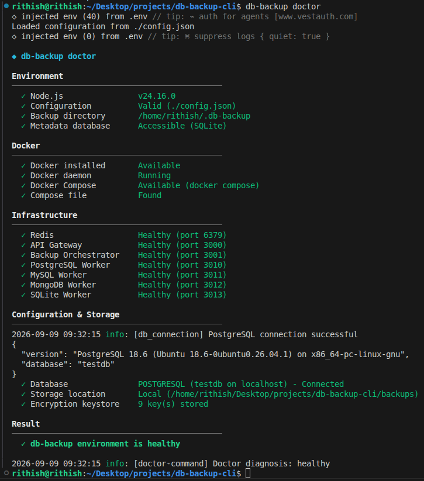
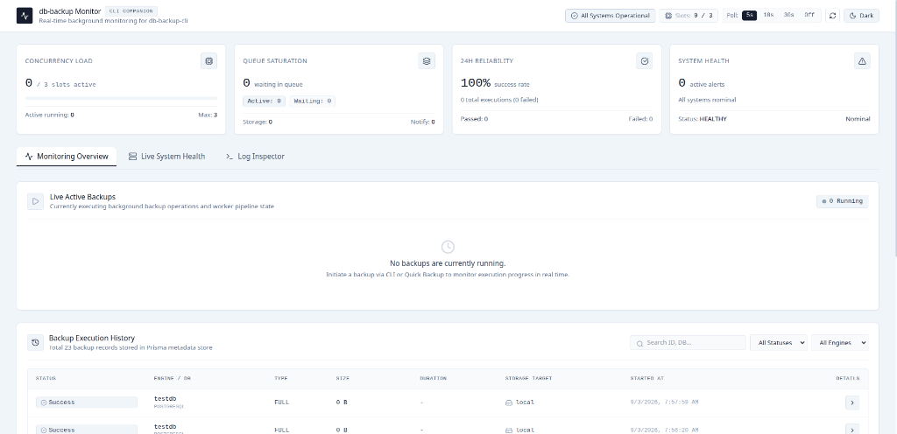
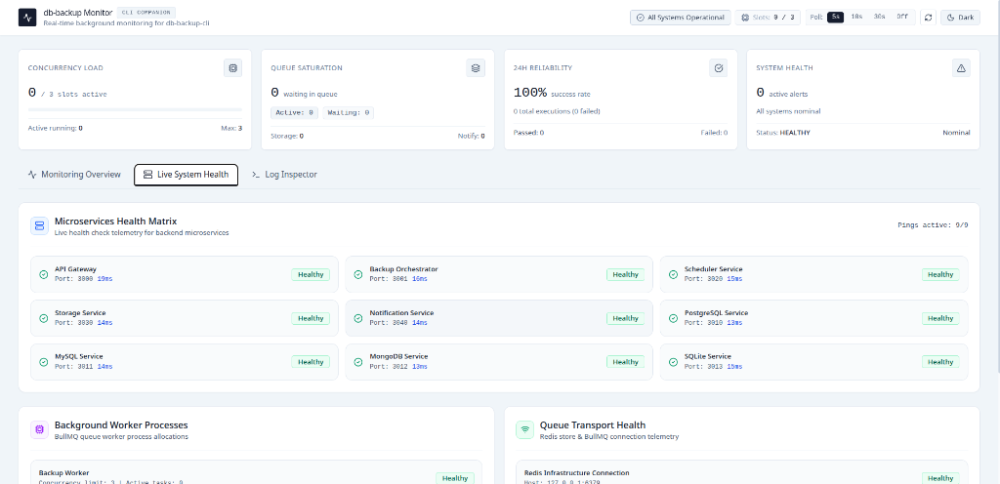
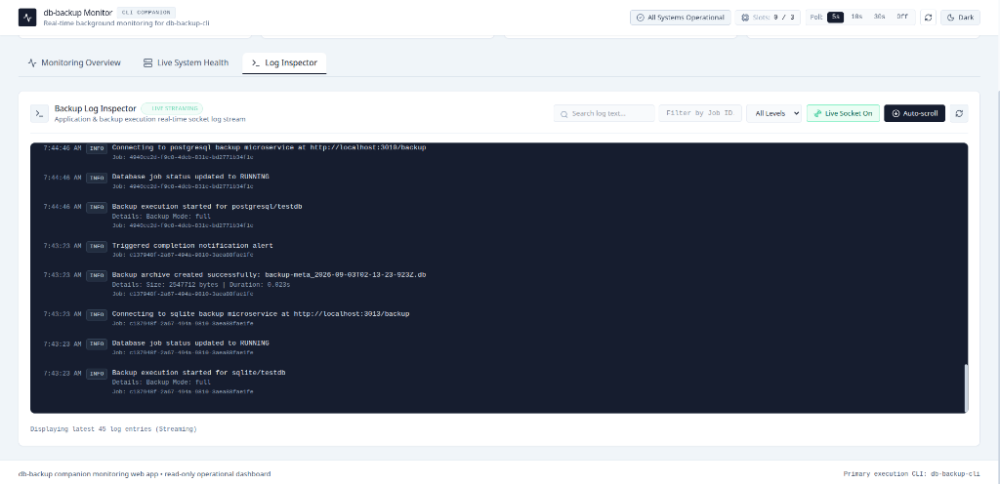
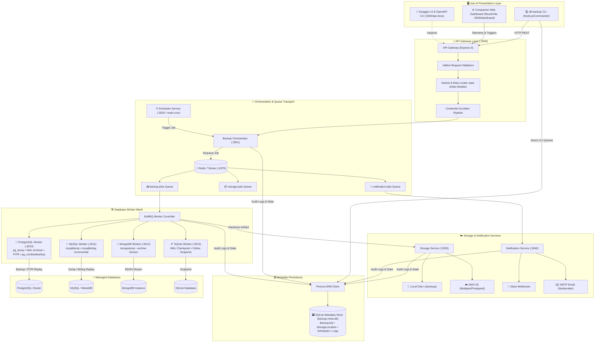
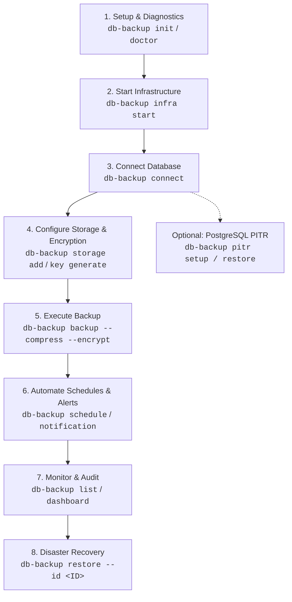

# DB Backup CLI 🛡️

<div align="center">


**A production-grade, distributed database disaster recovery and automated backup platform.**  
Featuring Point-In-Time Recovery (PITR), BullMQ asynchronous worker queues, multi-cloud storage (AWS S3 & Local), AES-256-GCM encryption, OpenAPI 3.0 specifications, and a real-time companion telemetry web dashboard.

[Features](#-key-features) • [Architecture](#-system-architecture) • [Dashboard & CLI Showcase](#-visual-showcase) • [Quick Start](#-quick-start) • [End-to-End User Guide](#-end-to-end-cli-flow-user-guide) • [CLI Command Reference](#-complete-cli-command-reference) • [API & Swagger](#-openapi--swagger-documentation) • [Docker Mesh](#-docker-microservices-mesh)

</div>

---

## 📸 Visual Showcase

### 1. Proactive Health Diagnostics (`db-backup doctor`)
The built-in diagnostic engine validates Node.js versions, configuration health, Docker daemon states, Redis connectivity, database access, keystores, and microservice HTTP endpoints before executing critical jobs.

<div align="center">
  
</div>

---

### 2. Companion Real-Time Monitoring Dashboard
A modern React + Vite monitoring dashboard providing 24-hour reliability metrics, queue saturation rates, live active backup tracking, and complete execution histories.

<div align="center">
  
</div>

---

### 3. Distributed Microservices Health Matrix
Live ping telemetry monitoring all 9 microservices, database workers, Redis connection state, and BullMQ worker process allocations.

<div align="center">
  
</div>

---

### 4. Real-Time Log Inspector & Live Socket Stream
Real-time log streaming directly from worker execution containers, featuring severity filtering (INFO, WARN, ERROR), job ID correlation, and auto-scrolling telemetry.

<div align="center">
  
</div>

---

## 🏗️ System Architecture

`db-backup-cli` is architected as an event-driven microservices mesh decoupled by **BullMQ** and **Redis**. Long-running database dumps never block CLI execution or HTTP threads; instead, operations are streamed through isolated worker containers with automatic retry policies and atomic storage writes.



---

## 🌟 Key Features

* **Multi-Engine Backup & Restore**: Native, zero-disk-overhead streaming support for **PostgreSQL**, **MySQL / MariaDB**, **MongoDB**, and **SQLite**.
* **PostgreSQL Point-In-Time Recovery (PITR)**: Continuous Write-Ahead Log (WAL) archiving via PostgreSQL's `archive_command`, timeline inspection, and timestamp recovery (`recovery_target_time`).
* **MySQL Binary Log Incremental Chains**: Automated incremental backups tracking `mysqlbinlog` position intervals relative to full base level-0 dumps.
* **Asynchronous Distributed Queues**: Powered by **BullMQ** and **Redis** for concurrency management, automatic backoff retries, and job state isolation.
* **Bank-Grade AES-256-GCM Encryption**: Payloads encrypted before storage with unique IVs, auth tags, and an isolated local keystore (`db-backup key`).
* **Multi-Cloud Storage Targets**: Seamless destination abstraction supporting local disks and AWS S3 buckets (with presigned URLs and streaming uploads).
* **Automated Cron Scheduling**: Persistent cron schedules (`db-backup schedule`) managed through an autonomous background scheduler daemon.
* **Proactive Diagnostics (`db-backup doctor`)**: Real-time evaluation of daemon health, host directories, port collisions, keystores, and container health.
* **On-Demand Infrastructure Lifecycle Manager (`db-backup infra`)**: Autonomous Docker Compose adapter to start, stop, restart, and inspect service health on demand.
* **Interactive Onboarding (`db-backup init`)**: Beautiful step-by-step terminal wizard powered by `@clack/prompts`.
* **Complete OpenAPI 3.0 & Swagger UI**: Interactive API documentation hosted at `http://localhost:3000/api-docs`.
* **Zero Credential Leaks**: Custom Winston logging pipeline automatically scrubs passwords, API keys, S3 secrets, and connection URIs from stdout and log files.

---

## 🚀 Quick Start

### Prerequisites
- **Node.js** `>= 20.0.0`
- **Docker** & **Docker Compose** (for microservice orchestration)
- **Redis** running on port `6379` (or launched via `db-backup infra start`)

### 1. Installation

#### Global Install (via npm)
```bash
npm install -g db-backup-cli
db-backup --help
```

#### From Source
```bash
git clone https://github.com/rithishcodespace/db-backup-cli.git
cd db-backup-cli
npm install
npm run build:all
npm link
```

### 2. Interactive Setup Wizard
Run the onboarding wizard to configure database credentials, default storage, and encryption keys:
```bash
db-backup init
```

### 3. Start Infrastructure & Run Diagnostics
```bash
# Start background microservice mesh via Docker
db-backup infra start

# Verify all services and database connectivity
db-backup doctor
```

### 4. Execute a Backup
```bash
# Perform a full backup with compression
db-backup backup --type full --compress

# Perform an AES-256 encrypted backup to AWS S3
db-backup backup --storage s3 --encrypt

# Perform a MySQL or PostgreSQL incremental backup
db-backup backup --incremental
```

---

## 🔄 End-to-End CLI Flow User Guide

The following flowchart illustrates the typical operational lifecycle of a production database disaster recovery setup using `db-backup`:



### Stage 1: Initial Setup & Environment Verification
1. Run the interactive onboarding wizard to configure database credentials, default storage target, and initial encryption keys:
   ```bash
   db-backup init
   ```
2. Inspect environment health, required ports, Redis, Docker, and file permissions:
   ```bash
   db-backup doctor
   ```
3. Start the background microservice mesh (if running via Docker):
   ```bash
   db-backup infra start
   db-backup infra status
   ```

### Stage 2: Database Connection & Verification
Connect your active database and test connectivity across any supported engine (PostgreSQL, MySQL, MongoDB, SQLite):
```bash
# PostgreSQL
db-backup connect --type postgresql --host localhost --port 5432 --user postgres --password secret --database my_production_db

# MySQL / MariaDB
db-backup connect --type mysql --host localhost --port 3306 --user root --password secret --database app_db

# MongoDB
db-backup connect --type mongodb --host localhost --port 27017 --database store_db

# SQLite
db-backup connect --type sqlite --database ./data/app.db
```
Verify the active configuration and service connectivity at any time:
```bash
db-backup config check
```

### Stage 3: Storage Destinations & Security Keystores
Set up local directory vaults or AWS S3 cloud buckets:
```bash
# Add a local off-site directory
db-backup storage add --type local --name local-vault --path /mnt/secure_backups

# Add an AWS S3 bucket destination
db-backup storage add --type s3 --name aws-vault --bucket my-company-backups --region us-east-1 --access-key AKIA... --secret-key wJalr...

# Set default storage destination
db-backup storage set-default aws-vault

# Test connectivity to a storage destination
db-backup storage test aws-vault

# Generate a 256-bit AES cryptographic key
db-backup key generate
db-backup key list
```

### Stage 4: Executing Database Backups
Trigger backups with streaming compression, AES-256-GCM encryption, and custom tables:
```bash
# Fast compressed full backup
db-backup backup --type full --compress

# Bank-grade encrypted backup uploaded to AWS S3
db-backup backup --storage aws-vault --compress --encrypt

# Backup specific tables only
db-backup backup --tables users,orders,transactions

# Non-blocking asynchronous backup queued via BullMQ
db-backup backup --async
```

### Stage 5: Scheduling & Multi-Channel Alerts
Automate recurring backup policies with cron expressions and connect alert integrations:
```bash
# Configure Slack notifications
db-backup notification slack configure --webhook https://hooks.slack.com/services/T00/B00/X00
db-backup notification slack test

# Configure SMTP Email notifications
db-backup notification email configure --smtp-host smtp.gmail.com --smtp-port 587 --smtp-user alerts@myorg.com --smtp-password "app-pwd" --from alerts@myorg.com --to devops@myorg.com
db-backup notification email test

# Schedule a daily backup at 2:00 AM with Slack + Email alerts
db-backup schedule --cron "0 2 * * *" --name "daily-production-backup" --storage s3 --retention 30 --notify slack,email

# Inspect all active automated backup schedules
db-backup schedule:list
```

### Stage 6: Telemetry, Logs & Monitoring
Inspect historical backups and launch the companion web dashboard:
```bash
# List all successful historical backups with full restore IDs
db-backup list --status success --limit 20

# Launch the companion React + Vite telemetry web dashboard
db-backup dashboard
```

### Stage 7: Disaster Recovery & Atomic Restoration
Restore database from disaster with full validation, dry runs, and safety prompts:
```bash
# 1. Perform a non-destructive dry-run first
db-backup restore --id <BACKUP_ID> --dry-run

# 2. Execute full restore (automatically retrieves encryption keys and validates SHA-256 checksums)
db-backup restore --id <BACKUP_ID>

# 3. Restore with table overwrite (drops existing tables before restoring data)
db-backup restore --id <BACKUP_ID> --drop-existing

# 4. Restore directly from a raw or encrypted local file
db-backup restore --file ./backups/production_dump.sql.gz.enc --key <64-HEX-KEY>
```

---

## 💻 Complete CLI Command Reference

Below is the exhaustive reference for all 15 commands and their options in `db-backup-cli`.

### 1. `db-backup init`
Interactive step-by-step terminal wizard powered by `@clack/prompts` to onboard a new environment, configure database credentials, default storage, and encryption keys.
```bash
db-backup init
```

### 2. `db-backup doctor`
Audits environment dependencies (Node.js, Docker, Compose), port health, Redis broker, background microservices, metadata SQLite database, and keystore state.
```bash
db-backup doctor
```

### 3. `db-backup infra`
Lifecycle management for the background microservices mesh.
- **Subcommands**:
  - `status` — Display status of Docker engine, containers, and ports.
  - `start` — Start all microservice containers in background.
  - `stop` — Stop background microservice containers.
  - `restart` — Restart all microservice containers.
  - `logs` — Stream real-time container logs.
```bash
db-backup infra status
db-backup infra start
db-backup infra logs
```

### 4. `db-backup connect`
Test connection to target database and save active configuration to `config.json`.
- **Options**:
  - `-t, --type <type>` *(required)*: `postgresql`, `mysql`, `mongodb`, or `sqlite`
  - `-H, --host <host>`: Database host *(default: localhost)*
  - `-p, --port <port>`: Port number *(default: engine standard)*
  - `-u, --user <username>`: Database username
  - `-P, --password <password>`: Database password
  - `-d, --database <name>`: Target database name *(required for non-SQLite)*
  - `--ssl`: Enable SSL encryption for connection
```bash
db-backup connect --type postgresql --host 127.0.0.1 --port 5432 --user postgres --password secret --database appdb --ssl
```

### 5. `db-backup backup`
Trigger a database backup via the decoupled application use case and worker mesh.
- **Options**:
  - `-t, --type <type>`: Backup type: `full` or `incremental` *(default: full)*
  - `--incremental`: Alias to trigger incremental backup
  - `-c, --compress`: Stream compress backup archive using Gzip
  - `-e, --encrypt`: Encrypt backup archive using AES-256-GCM
  - `--key <key>`: 64-hexadecimal custom encryption key *(auto-generated if omitted)*
  - `--no-store-key`: Do not save generated encryption key in local keystore
  - `-s, --storage <name>`: Destination storage location name *(default: active default)*
  - `-o, --output <dir>`: Local destination directory path
  - `-n, --name <name>`: Custom base name for backup artifact
  - `--tables <tables>`: Comma-separated list of tables to include
  - `--exclude-tables <tables>`: Comma-separated list of tables to skip
  - `--async`: Submit job to BullMQ queue and return immediately
```bash
# Full backup with compression and AES-256-GCM encryption
db-backup backup --compress --encrypt

# Backup specific tables to S3 asynchronously
db-backup backup --tables users,orders --storage s3 --async
```

### 6. `db-backup list`
List historical backups recorded in database metadata with full untruncated IDs.
- **Options**:
  - `-d, --database <name>`: Filter by database name
  - `-t, --type <type>`: Filter by type (`full`, `incremental`)
  - `-l, --limit <number>`: Maximum records to show *(default: 20)*
  - `--status <status>`: Filter by status (`success`, `failed`, `running`) *(default: success)*
  - `--full-id`: Show untruncated backup UUIDs *(default: true)*
```bash
db-backup list --status success --limit 10
```

### 7. `db-backup restore`
Restore a database from a backup record or local file using the resilient `RestoreUseCase` pipeline.
- **Options**:
  - `-i, --id <id>`: Full backup ID (UUID from `db-backup list`)
  - `-f, --file <path>`: Local backup file path to restore from
  - `-t, --tables <tables>`: Comma-separated tables to restore
  - `--drop-existing`: Clean target database tables before restoring
  - `--dry-run`: Validate checksums, decrypt, and decompress without executing restore
  - `--force`: Force table overwrite without interactive confirmation
  - `--skip-checksum`: Bypass SHA-256 checksum integrity verification
  - `--key <key>`: 64-hexadecimal character AES decryption key (if not in keystore)
```bash
# Dry run verification
db-backup restore --id b8a7d123-4567-89ab-cdef-0123456789ab --dry-run

# Full restore with drop-existing
db-backup restore --id b8a7d123-4567-89ab-cdef-0123456789ab --drop-existing
```

### 8. `db-backup pitr`
PostgreSQL Continuous Archiving and Point-In-Time Recovery.
- **Subcommands**:
  - `setup [--auto-configure] [--storage <name>]` — Inspect or auto-configure `wal_level` and `archive_command`.
  - `status` — View active WAL archiving rates and recoverable timeline boundaries.
  - `backup` — Create a physical base backup using `pg_basebackup`.
  - `restore --time <ISO-timestamp> [--target <dir>]` — Restore cluster to an exact past second.
  - `list` — List all physical base backups and archived WAL segments.
```bash
db-backup pitr setup --auto-configure
db-backup pitr status
db-backup pitr backup
db-backup pitr restore --time "2026-09-09T09:30:00Z"
```

### 9. `db-backup storage`
Manage local and cloud storage repositories.
- **Subcommands**:
  - `add` — Add storage location.
    - `-t, --type <local|s3>` *(required)*
    - `-n, --name <name>` *(required)*
    - `-p, --path <path>` *(for local)*
    - `-b, --bucket <bucket>` *(for S3)*
    - `-r, --region <region>` *(for S3)*
    - `--access-key <key>`, `--secret-key <key>`, `--prefix <prefix>`
  - `list` — List configured storage locations.
  - `show <name>` — Inspect details of a specific storage location.
  - `set-default <name>` — Set designated default storage location.
  - `remove <name>` — Remove a storage location.
  - `test <name>` — Test read/write connectivity to storage location.
```bash
db-backup storage add --type s3 --name cloud-s3 --bucket corp-backups --region us-east-1 --access-key AKIA... --secret-key ...
db-backup storage test cloud-s3
db-backup storage set-default cloud-s3
```

### 10. `db-backup key`
Manage local AES-256 encryption keys in the secure local keystore.
- **Subcommands**:
  - `generate` — Generate a new cryptographically secure 256-bit (64 hex characters) key.
  - `list` — View all local encryption keys (masked for safety).
  - `export [--output <file>]` — Export keystore to a secure JSON file for disaster recovery.
```bash
db-backup key generate
db-backup key list
db-backup key export --output ~/backup-keys-export.json
```

### 11. `db-backup schedule`
Create recurring backup cron schedules managed by the background scheduler daemon.
- **Options**:
  - `-c, --cron <expression>` *(required)*: 5-segment cron string (e.g. `"0 2 * * *"`)
  - `-t, --type <type>`: `full` or `incremental` *(default: full)*
  - `-n, --name <name>`: Unique identifier name for schedule
  - `--storage <type>`: Target storage (`local`, `s3`) *(default: local)*
  - `--retention <days>`: Retention period in days *(default: 30)*
  - `--notify <providers>`: Comma-separated alert channels (`email`, `slack`)
```bash
db-backup schedule --cron "0 2 * * *" --name "nightly-backup" --storage s3 --notify slack,email
```

### 12. `db-backup schedule:list`
List all active automated backup cron schedules, including next run projections and notification statuses.
```bash
db-backup schedule:list
```

### 13. `db-backup notification`
Configure and test alert dispatchers for backup completions and failures.
- **Subcommands**:
  - `email configure` — Setup SMTP transport (`--smtp-host`, `--smtp-port`, `--smtp-user`, `--smtp-password`, `--from`, `--to`).
  - `email test` — Send a test email alert.
  - `slack configure` — Setup Slack Incoming Webhook (`--webhook <url>`).
  - `slack test` — Send a test message to the configured Slack channel.
  - `status` — View current status of notification channels.
```bash
db-backup notification slack configure --webhook https://hooks.slack.com/services/...
db-backup notification slack test
db-backup notification status
```

### 14. `db-backup dashboard`
Launch the companion React + Vite real-time monitoring dashboard in your browser.
- **Options**:
  - `-p, --port <port>`: Port to open dashboard on *(default: 5173 or 3000)*
  - `--url <url>`: Connect to remote dashboard gateway URL
```bash
db-backup dashboard
```

### 15. `db-backup config`
Inspect and validate CLI runtime configuration.
- **Subcommands**:
  - `check` — Validate `./config.json`, client identity, and service health against runtime schemas.
```bash
db-backup config check
```

---

## ⏱️ PostgreSQL Point-In-Time Recovery (PITR)

`db-backup-cli` provides native Point-in-Time Recovery for PostgreSQL:

```bash
# 1. Verify and auto-configure PostgreSQL WAL archiving
db-backup pitr setup --auto-configure

# 2. Inspect WAL archiving status and recovery boundaries
db-backup pitr status

# 3. Create a physical base backup via pg_basebackup
db-backup pitr backup

# 4. Restore the cluster to an exact target second before an incident
db-backup pitr restore --time "2026-09-09T09:30:00Z" --target "/var/lib/postgresql/restored"
```

---

## 📑 OpenAPI & Swagger Documentation

The API Gateway hosts interactive **Swagger UI** documentation and raw OpenAPI 3.0 JSON specifications covering all microservice endpoints:

* **Interactive Swagger UI**: [http://localhost:3000/api-docs](http://localhost:3000/api-docs)
* **OpenAPI 3.0 Spec (JSON)**: [http://localhost:3000/api-docs/json](http://localhost:3000/api-docs/json)

```text
POST   /api/backup                 # Trigger an asynchronous backup job
GET    /api/backup/:id/status      # Poll real-time job status and progress
POST   /api/restore                # Trigger a restore workflow
GET    /api/dashboard/stats        # Get system health, queue load, and success rates
GET    /api/dashboard/logs         # Stream recent worker logs
POST   /api/storage/upload         # Upload backup artifact to storage target
POST   /api/notifications/test     # Send test alert to Slack / Email
GET    /health                     # Gateway health check
```

---

## 🐳 Docker Microservices Mesh

The complete microservices mesh is orchestrated via [`docker-compose.yaml`](docker-compose.yaml) with multi-stage, security-hardened Alpine containers running as non-root `node` users:

| Service | Port | Description |
| :--- | :---: | :--- |
| **Redis** | `6379` | In-memory message broker & BullMQ queue transport |
| **API Gateway** | `3000` | Public Express gateway, Swagger UI, and dashboard server |
| **Backup Orchestrator** | `3001` | BullMQ job queue manager and coordinator |
| **Scheduler Service** | `3020` | Cron-based automated execution daemon |
| **Storage Service** | `3030` | Local disk and AWS S3 storage provider |
| **Notification Service** | `3040` | Slack Webhook and Nodemailer SMTP dispatcher |
| **PostgreSQL Worker** | `3010` | Isolated worker with `pg_dump`, `pg_basebackup`, and `pg_combinebackup` |
| **MySQL Worker** | `3011` | Isolated worker with `mysqldump` and `mysqlbinlog` |
| **MongoDB Worker** | `3012` | Isolated worker with `mongodump` and `mongorestore` |
| **SQLite Worker** | `3013` | Isolated worker with SQLite WAL snapshot utilities |

```bash
# Start all microservices in the background
npm run docker:up

# View real-time aggregated logs
npm run docker:logs

# Tear down the stack without losing backup data
npm run docker:down
```

---

## 🧪 Automated Testing Suite

The repository includes deterministic unit tests, end-to-end API gateway validation, and complete real data lifecycle tests:

```bash
# Run complete test suite (Unit + E2E)
npm test

# Run unit tests only
npm run test:unit

# Run API Gateway E2E tests
npm run test:e2e

# Run integration tests (real lifecycle, incremental, PITR)
node --test tests/integration/*.test.js

# Run TypeScript type check and linter
npm run build && npm run lint
```

**Status:** ✅ **100 passing tests** (87 unit tests + 7 e2e tests + 6 integration tests), **0 failures**, **0 skipped**.
- **Real Data Lifecycle Verification**: Full relational SQLite dataset backed up with Gzip compression and AES-256-GCM encryption, intentionally corrupted/deleted, restored through `RestoreUseCase`, and verified for **100% bit-for-bit data fidelity**.
- **Negative Scenarios**: Validated rejection on altered SHA-256 checksums and invalid AES decryption keys.

---

## 📁 Repository Layout

```text
db-backup-cli/
├── bin/                          # Executable binary entrypoint (bin/db_backup.js)
├── dashboard/                    # Companion React + Vite Web Monitoring Dashboard
│   ├── src/                      # UI Components (Health Matrix, Log Inspector, Stats)
│   └── dist/                     # Compiled production UI bundle
├── docker/                       # Production multi-stage Dockerfiles
│   ├── Dockerfile.gateway        # Gateway & Static Dashboard Container
│   ├── Dockerfile.orchestrator   # BullMQ Orchestrator Container
│   ├── Dockerfile.postgres       # PostgreSQL Worker Container
│   ├── Dockerfile.mysql          # MySQL Worker Container
│   ├── Dockerfile.mongodb        # MongoDB Worker Container
│   └── Dockerfile.sqlite         # SQLite Worker Container
├── docs/                         # Architecture assets and documentation
│   └── images/                   # High-resolution screenshots and visuals
├── prisma/                       # Prisma ORM schema and SQLite migrations
├── scripts/                      # Service lifecycle and cross-platform runners
├── src/                          # TypeScript source code (Clean Architecture)
│   ├── domain/                   # Enterprise Domain Layer (models, errors, interfaces)
│   ├── application/              # Application Layer (Use Cases: Backup, Restore, Connect, List)
│   ├── infrastructure/           # Infrastructure Layer (DB Adapters, Crypto, Compression, Storage)
│   ├── commands/                 # Presentation Controllers (15 CLI command implementations)
│   ├── config/                   # Centralized configuration loader
│   ├── microservices/            # Gateway, orchestrator, and database workers
│   ├── services/                 # PITR, incremental, and dashboard services
│   ├── swagger/                  # OpenAPI 3.0 specification generator
│   └── validators/               # Valibot request validation schemas
├── tests/                        # Unit, E2E, and integration test suites
│   ├── unit/                     # Domain, adapter, security, and command unit tests (87 tests)
│   ├── e2e/                      # API Gateway E2E validation tests (7 tests)
│   └── integration/              # Real data lifecycle, PostgreSQL PITR, and incremental tests (6 tests)
├── docker-compose.yaml           # Master multi-container Compose orchestration
└── package.json                  # Dependencies, scripts, and npm metadata
```

---

## 🤝 Contributing

Contributions are welcome! Please check out [CONTRIBUTING.md](CONTRIBUTING.md) and [CODE_OF_CONDUCT.md](CODE_OF_CONDUCT.md) before submitting pull requests.

1. Fork the Project
2. Create your Feature Branch (`git checkout -b feature/AmazingFeature`)
3. Commit your Changes (`git commit -m 'feat: add AmazingFeature'`)
4. Push to the Branch (`git push origin feature/AmazingFeature`)
5. Open a Pull Request

---

## 📄 License

This project is licensed under the MIT License. See the [LICENSE](LICENSE) file for details.
