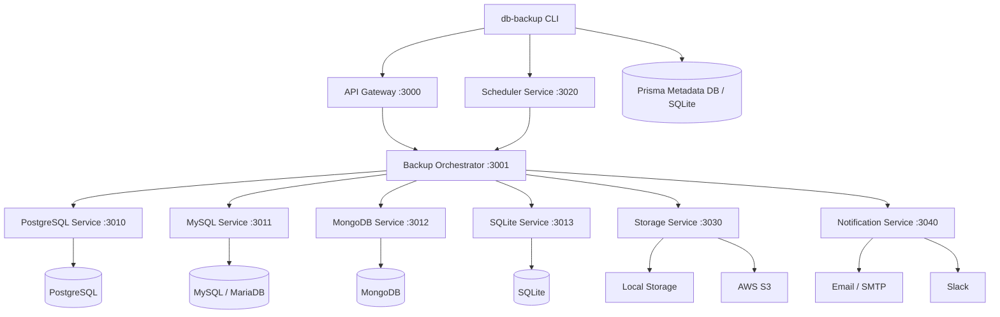

# DB Backup CLI

DB Backup CLI is a TypeScript-based command-line tool for connecting to databases, creating backups, restoring data, managing backup storage, and scheduling automated runs. It is designed as an npm package with a microservice-oriented runtime for backup orchestration, storage, scheduling, and notifications.

This README reflects the current repository implementation and the package entrypoint exposed by the `db-backup` binary.

## Features

- Database connection setup with persisted configuration
- Backup creation with full, incremental, and differential modes
- Backup listing with filtering and full backup IDs
- Restore from local files or S3-backed backup locations
- Storage management for local and S3 targets
- Schedule creation and schedule listing
- Email and Slack notification configuration and testing
- Structured logging and environment-based configuration
- Prisma-backed metadata persistence

## Architecture Overview

The project is organized around a CLI front end and a set of cooperating services:

- CLI commands capture user input and send requests to the backend services
- The API Gateway exposes the public HTTP entrypoint
- The Backup Orchestrator coordinates backup execution
- Database-specific services handle backup and restore workflows
- The Scheduler Service manages cron-based automation
- The Storage Service abstracts backup destinations
- The Notification Service sends email and Slack alerts
- Prisma stores metadata such as backups, storage locations, schedules, and notifications



## Tech Stack

- Node.js
- TypeScript
- Commander
- Prisma ORM
- SQLite metadata store
- Axios
- Chalk
- Ora
- Winston-based logging
- AWS SDK for S3 integration
- Nodemailer for email notifications

## Folder Structure

```text
db-backup-cli/
├── bin/                  # Executable entrypoint for the published package
├── generated/prisma/     # Prisma client output
├── prisma/               # Prisma schema and migrations
├── scripts/              # Start/stop/setup helper scripts
├── src/                  # TypeScript source
│   ├── commands/         # CLI command implementations
│   ├── config/           # Runtime configuration loader
│   ├── lib/              # Shared runtime libraries
│   ├── logger/           # Logging helpers
│   ├── microservices/    # Service implementations and providers
│   ├── services/         # Higher-level application services
│   ├── types/            # Shared types
│   └── utils/            # Utility helpers
├── tests/                # Manual and service-level test scripts
├── backups/              # Local backup output
├── logs/                 # Application logs
├── tmp/                  # Temporary files
├── docker-compose.yaml   # Container orchestration
├── package.json          # Package metadata and scripts
├── prisma.config.ts      # Prisma configuration
├── tsconfig.json         # TypeScript configuration
└── README.md             # Project documentation
```

## Installation

### Prerequisites

- Node.js 20 or newer
- npm 10 or newer
- A supported database server to connect to
- Docker if you plan to use the containerized workflow

### Install from npm

Once published, install the package globally:

```bash
npm install -g db-backup-cli
```

Then verify the binary:

```bash
db-backup --help
```

### Local development install

```bash
git clone https://github.com/rithishcodespace/db-backup-cli.git
cd db-backup-cli
npm install
npx prisma generate
npm run build
```

### Run locally

```bash
npm run dev
```

If you want to test the package binary locally after a build, use:

```bash
npm link
db-backup --help
```

## Environment Variables

Create a `.env` file from [`.env.example`](.env.example) and customize the values for your environment.

| Variable | Purpose | Default / Notes |
|---|---|---|
| `NODE_ENV` | Application environment | `development` unless overridden |
| `LOG_LEVEL` | Logging verbosity | `info` |
| `LOG_PATH` | Log output directory | `./logs` |
| `LOG_MAX_FILES` | Number of rotated log files to keep | `30` |
| `LOG_MAX_SIZE` | Maximum size per log file | `20m` |
| `BACKUP_PATH` | Default backup directory | `./backups/local` |
| `TEMP_PATH` | Temporary workspace | `./tmp` |
| `BACKUP_RETENTION_DAYS` | Default retention window | `30` |
| `MAX_PARALLEL_BACKUPS` | Maximum parallel backup jobs | `3` |
| `DATABASE_URL` | Prisma metadata database URL | `file:./backup-meta.db` |
| `CONFIG_PATH` | Custom config file path | `./config.json` unless overridden |
| `GATEWAY_URL` | API Gateway URL | `http://localhost:3000` |
| `ORCHESTRATOR_URL` | Backup Orchestrator URL | `http://localhost:3001` |
| `STORAGE_SERVICE_URL` | Storage Service URL | optional |
| `NOTIFICATION_SERVICE_URL` | Notification Service URL | optional |
| `AWS_REGION` | Default AWS region | `us-east-1` |
| `AWS_ACCESS_KEY_ID` | AWS access key | required for S3 |
| `AWS_SECRET_ACCESS_KEY` | AWS secret key | required for S3 |
| `AWS_S3_BUCKET` | S3 bucket name | required for S3 |
| `AWS_S3_FOLDER` | Default S3 folder prefix | `backups` |
| `SLACK_WEBHOOK_URL` | Slack webhook URL | optional |
| `SMTP_HOST` | SMTP host | optional |
| `SMTP_PORT` | SMTP port | `587` |
| `SMTP_SECURE` | Use TLS for SMTP | `false` |
| `SMTP_USER` | SMTP username | optional |
| `SMTP_PASS` | SMTP password | optional |
| `SMTP_FROM` | Sender address | optional |
| `SMTP_TO` | Default recipient address | optional |

## Configuration

The CLI uses two layers of configuration:

1. Environment variables for runtime defaults and service endpoints
2. A persisted `config.json` file for database connection details and local settings

The first successful `db-backup connect` command saves database configuration to `config.json`. The configuration loader also creates missing working directories such as the backup path, temp path, and log path.

Important configuration files:

- [package.json](package.json) for package metadata, binary entrypoint, and scripts
- [tsconfig.json](tsconfig.json) for TypeScript compilation
- [prisma/schema.prisma](prisma/schema.prisma) for the metadata model
- [docker-compose.yaml](docker-compose.yaml) for service orchestration

## Database Support

The CLI currently supports these database engines for backup and restore workflows:

- PostgreSQL
- MySQL and MariaDB
- MongoDB
- SQLite

Connection details are provided through the `connect` command. For non-SQLite databases, a database name is required. SQLite works with local file-based storage.

## Storage Providers

### Local Storage

- Stores backup files on the local filesystem
- Uses a configurable base path, defaulting to the local backup directory
- Best for development, single-machine deployments, and fast restore workflows

### AWS S3

- Uploads and downloads backups using the AWS SDK
- Supports region, bucket, access key, secret key, and optional prefix configuration
- Suitable for remote storage, retention, and offsite backup policies

## Scheduler

Scheduling is provided through cron expressions.

Available scheduler commands:

- `db-backup schedule` to create a schedule
- `db-backup schedule:list` to list schedules

Schedules support:

- Cron expressions
- Backup type selection
- Storage selection
- Retention settings
- Email and Slack notification targeting

## Notifications

Notification configuration is managed through the CLI and persisted in metadata storage.

Supported notification providers:

- Email via SMTP
- Slack via webhook

Available notification commands:

- `db-backup notification email configure`
- `db-backup notification email test`
- `db-backup notification email show`
- `db-backup notification email remove`
- `db-backup notification slack configure`
- `db-backup notification slack test`
- `db-backup notification slack show`
- `db-backup notification slack remove`

## Backup Workflow

1. Connect to the target database with `db-backup connect`.
2. Optionally register storage with `db-backup storage add`.
3. Optionally configure notifications with `db-backup notification ...`.
4. Run `db-backup backup` with the desired backup type and options.
5. Review the resulting backup metadata with `db-backup list`.

Common backup options:

- `--type` for full, incremental, or differential backups
- `--compress` or `--no-compress`
- `--output` for a custom destination path
- `--name` for a custom backup label
- `--tables` and `--exclude-tables` for table selection
- `--storage` to target a named storage location

## Restore Workflow

1. Identify the backup with `db-backup list`.
2. Restore by backup ID or file path with `db-backup restore`.
3. Optionally use `--dry-run`, `--force`, or `--skip-checksum`.
4. For S3-backed restores, supply an `s3://bucket/key` path.

Restore modes supported by the CLI:

- Restore from a full backup ID
- Restore from a local file
- Restore from S3
- Selective table restore where supported
- Dry-run validation before applying changes

## CLI Command Reference

### Global Options

```bash
db-backup --help
db-backup --version
db-backup --config ./config.json
db-backup --verbose
db-backup --no-color
```

### Core Commands

#### Connect

```bash
db-backup connect --type postgresql --host localhost --port 5432 --user admin --password secret --database appdb
```

Options:

- `--type <type>`: `postgresql`, `mysql`, `mongodb`, or `sqlite`
- `--host <host>`: database host
- `--port <port>`: database port
- `--user <username>`: database username
- `--password <password>`: database password
- `--database <database>`: database name
- `--ssl`: enable SSL

#### Backup

```bash
db-backup backup --type full --compress --name nightly_backup
```

Options:

- `--type <type>`: `full`, `incremental`, or `differential`
- `--compress` / `--no-compress`
- `--output <path>`: output directory
- `--name <name>`: custom backup name
- `--tables <tables>`: comma-separated table list
- `--exclude-tables <tables>`: comma-separated exclusion list
- `--async`: return immediately after scheduling
- `--storage <name>`: named storage location

#### List

```bash
db-backup list --limit 10 --status success
```

Options:

- `--database <name>`: filter by database name
- `--type <type>`: filter by backup type
- `--limit <number>`: maximum results
- `--status <status>`: `success`, `failed`, or `running`
- `--full-id`: show full backup IDs

#### Restore

```bash
db-backup restore --id <backup-id>
db-backup restore --file ./backups/example.sql.gz
db-backup restore --file s3://my-bucket/backups/example.sql.gz
```

Options:

- `--id <id>`: restore by backup ID
- `--file <path>`: restore from a local or S3 path
- `--tables <tables>`: comma-separated table selection
- `--drop-existing`: drop existing tables before restore
- `--dry-run`: validate without applying changes
- `--force`: force restore
- `--skip-checksum`: skip checksum validation

#### Schedule

```bash
db-backup schedule --cron "0 2 * * *" --type full --storage local --retention 30
```

Options:

- `--cron <expression>`: required cron expression
- `--type <type>`: backup type
- `--name <name>`: schedule name
- `--storage <type>`: `local` or `s3`
- `--retention <days>`: retention window
- `--notify <providers>`: comma-separated providers such as `email,slack`

#### Schedule List

```bash
db-backup schedule:list
```

#### Storage

```bash
db-backup storage add --type local --name local-backups --path ./backups
db-backup storage list
db-backup storage show local-backups
db-backup storage set-default local-backups
db-backup storage remove local-backups --force
```

#### Notification

Email:

```bash
db-backup notification email configure \
  --smtp-host smtp.gmail.com \
  --smtp-port 587 \
  --smtp-user you@example.com \
  --smtp-password app-password \
  --from you@example.com \
  --to recipient@example.com
```

Slack:

```bash
db-backup notification slack configure --webhook https://hooks.slack.com/services/XXX/YYY/ZZZ
```

## Usage Examples

### Connect to PostgreSQL

```bash
db-backup connect \
  --type postgresql \
  --host localhost \
  --port 5432 \
  --user admin \
  --password secret \
  --database appdb
```

### Create a compressed full backup

```bash
db-backup backup --type full --compress --name appdb_nightly
```

### Filter recent successful backups

```bash
db-backup list --limit 5 --status success
```

### Restore from a backup file

```bash
db-backup restore --file ./backups/appdb_nightly.sql.gz --dry-run
```

### Create a schedule with notifications

```bash
db-backup schedule \
  --cron "0 2 * * *" \
  --type full \
  --storage local \
  --retention 30 \
  --notify email,slack
```

### Add and use S3 storage

```bash
db-backup storage add \
  --type s3 \
  --name offsite \
  --bucket my-backup-bucket \
  --region us-east-1 \
  --access-key AKIA... \
  --secret-key secret \
  --prefix db-backups

db-backup storage set-default offsite
db-backup backup --type full --name offsite_backup
```

## Screenshots

Add real screenshots here before publishing the package page and GitHub repository:

```text
docs/screenshots/cli-help.png
docs/screenshots/backup-flow.png
docs/screenshots/storage-management.png
docs/screenshots/schedule-view.png
```

## FAQ

### Do I need Docker to use this project?

No. You can run the CLI locally with Node.js. Docker is useful when you want to run the service stack in containers.

### Where is my database connection saved?

The `connect` command persists the database configuration to `config.json` so later commands can reuse it.

### Can I restore from S3?

Yes. The restore command accepts an `s3://bucket/key` path in the `--file` option.

### Which storage providers are implemented today?

Local filesystem storage and AWS S3 are implemented in the current codebase.

### Does the CLI support notifications?

Yes. Email and Slack notifications can be configured, tested, shown, and removed from the CLI.

## Troubleshooting

### `No database configuration found`

Run `db-backup connect` first. That command writes the database settings to `config.json`.

### `Cannot connect to API Gateway`

Start the local services before running backup, schedule, or restore workflows.

### `Storage location not found`

Create storage first with `db-backup storage add` or set an existing storage location as the default.

### `Email configuration not found` or `Slack configuration not found`

Configure the provider before using it in schedules or alerts.

### `Backup request failed`

Check database connectivity, service availability, environment variables, and the output of `--verbose`.

## Performance Notes

- Compression reduces transfer size at the cost of CPU usage
- Local storage is faster than remote storage for write-heavy backup jobs
- S3 adds network latency but improves offsite durability
- Incremental and differential backups can reduce runtime for large datasets
- Retention policies help keep storage usage under control
- Backup duration depends on database size, table selection, network throughput, and storage target

## Security Notes

- Do not commit real credentials to `.env`, `config.json`, or the README examples
- Use least-privilege database, storage, and SMTP credentials
- Prefer secure transport between the CLI and service endpoints
- Restrict read/write access to the backup and logs directories
- Rotate AWS, SMTP, and Slack credentials regularly
- Keep the metadata database private because it contains operational backup details
- Exclude generated backup files from source control

## Future Improvements

- Additional storage providers
- Expanded automated test coverage
- CI workflows for build, lint, package validation, and release publishing
- Stronger container hardening and health checks
- More robust observability and metrics export
- Release notes automation and changelog generation
- Signed npm releases and provenance metadata

## Contributing

Contributions are welcome.

Before opening a pull request:

```bash
npm install
npm run build
npm run lint
```

If your change affects the service stack or command behavior, also run the relevant service-level checks in `tests/`.

Please keep pull requests focused and include a short summary of the user-facing impact.

## License

ISC License. See [package.json](package.json) for the current license declaration.
